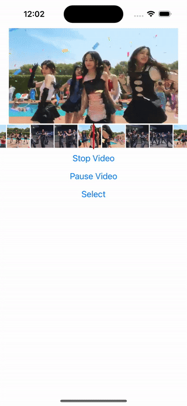

# react-native-video-frame-seekbar

A React Native component that allows users to seek through video frames and select a range directly on the seekbar. This library is designed to enhance video playback experience by providing a visual frame timeline and selection capability.

## Features

- **Frame Seeking:** Navigate through video by viewing frames on the seekbar.
- **Range Selection:** Select a specific range within the video directly from the seekbar.

## Installation

```bash
npm install react-native-video-frame-seekbar
# or
yarn add react-native-video-frame-seekbar
```

## Usage

To use this component, you need to provide frame images separately. The library does not include frame extraction functionality, but you can use `ffmpeg-kit-react-native` for extracting frames.

### Example

```jsx
import React, { useCallback } from 'react';
import { Button, SafeAreaView } from 'react-native';
import VideoFrameSeekbar from 'react-native-video-frame-seekbar';

function App(): React.JSX.Element {
    const videoRef = useRef<Video>();
    const currentTimeRef = useRef<number>(0);
    const [playing, setPlaying] = useState<boolean>(false);
    const [select, setSelect] = useState<Select | undefined>(undefined);

    const {asset, selectVideo, closeVideo} = useLocalVideo();
    const {frames, clearFrames} = useVideoFrames(asset);

    useEffect(() => {
        if (asset) {
            videoRef.current?.seek(0);
            setPlaying(true);
        } else {
            setPlaying(false);
        }
    }, [asset]);

    const stopVideo = () => {
        closeVideo();
        clearFrames();
    };

    const pauseVideo = () => {
        setPlaying(false);
    };

    const startSelection = () => {
        setPlaying(false);
        setSelect({
            start: currentTimeRef.current - 2000,
            end: currentTimeRef.current + 2000,
        });
    };
    const finishSelection = () => {
        setPlaying(true);
        setSelect(undefined);
    };

    const frameProvider = useCallback(
        (milliseconds: number): string | null => {
        const seconds = Math.floor(milliseconds / 1000);
        if (frames.length > seconds) {
            return frames[seconds]!;
        }
        return null;
    },
    [frames],
);
    const currentTimeProvider = useCallback(async () => {
        return currentTimeRef.current;
    }, []);
    const onStartDrag = useCallback(() => {
        setPlaying(false);
    }, []);
    const onDrag = useCallback((time: number) => {
        videoRef.current?.seek(time / 1000);
    }, []);
    const onEndDrag = useCallback((time: number) => {
        videoRef.current?.seek(time / 1000);
        setPlaying(true);
    }, []);

    const thumbsDragStart = useCallback(() => {
        setPlaying(false);
    }, []);
    const thumbsDrag = useCallback((position: number) => {
        videoRef.current?.seek(position / 1000);
    }, []);
    const thumbsDragEnd = useCallback(
        (opt: {start: number; end: number}, type: 'START' | 'END') => {
            setSelect({
                start: opt.start,
                end: opt.end,
            });
        },
        [],
    );

    return (
        <SafeAreaView>
            {!asset ? (
                <Button title="Select Video" onPress={selectVideo} />
            ) : (
                <>
                    <Video
                        paused={!playing}
                        source={{uri: asset.uri!}} // Can be a URL or a local file.
                        ref={videoRef} // Store reference
                        style={{width: '100%', height: 200}}
                        progressUpdateInterval={10}
                        onProgress={data => {
                            currentTimeRef.current = data.currentTime * 1000;
                        }}
                    />
                    <VideoFrameSeekbar
                        totalDuration={(asset.duration || 0) * 1000}
                        select={select}
                        thumbsDragStart={thumbsDragStart}
                        thumbsDrag={thumbsDrag}
                        thumbsDragEnd={thumbsDragEnd}
                        onStartDrag={onStartDrag}
                        onDrag={onDrag}
                        onEndDrag={onEndDrag}
                        frameProvider={frameProvider}
                        currentTimeProvider={currentTimeProvider}
                    />
                    <Button title="Stop Video" onPress={stopVideo} />
                    <Button title="Pause Video" onPress={pauseVideo} />
                    {select ? (
                        <Button title="Cancel Select" onPress={finishSelection} />
                    ) : (
                        <Button title="Select" onPress={startSelection} />
                    )}
                </>
            )}
        </SafeAreaView>
    );
}
```

### Props

The component accepts the following props:

| Prop                | Type                          | Description                                   |
|---------------------|-------------------------------|-----------------------------------------------|
| `totalDuration`     | `number`                      | Total duration of the video in milliseconds.  |
| `currentTimeProvider` | `() => Promise<number>`      | Function to provide the current time of the video. |
| `frameProvider`     | `(milliseconds: number) => string \| null` | Function to provide the frame image source for a given time. |
| `size`              | `number?`                     | Optional. Size of the seekbar.                |
| `onStartDrag`       | `() => void`                  | Optional. Callback when dragging starts.      |
| `onDrag`            | `(position: number) => void`  | Optional. Callback during dragging.           |
| `onEndDrag`         | `(position: number) => void`  | Optional. Callback when dragging ends.        |
| `select`            | `Select \| null`              | Optional. Object for range selection.         |
| `thumbsDragStart`   | `() => void`                  | Optional. Callback when thumb dragging starts.|
| `thumbsDrag`        | `(position: number) => void`  | Optional. Callback during thumb dragging.     |
| `thumbsDragEnd`     | `({start: number; end: number}, target: 'START' \| 'END') => void` | Optional. Callback when thumb dragging ends.  |

> **Note:** It's recommended to use `useCallback` for the callback props to avoid unnecessary re-renders.

## Demo

| Action            | Demo                                    |
|-------------------|-----------------------------------------|
| **Seeking**       |    |
| **Range Selection** |               |

## License

This project is licensed under the MIT License - see the LICENSE file for details.
